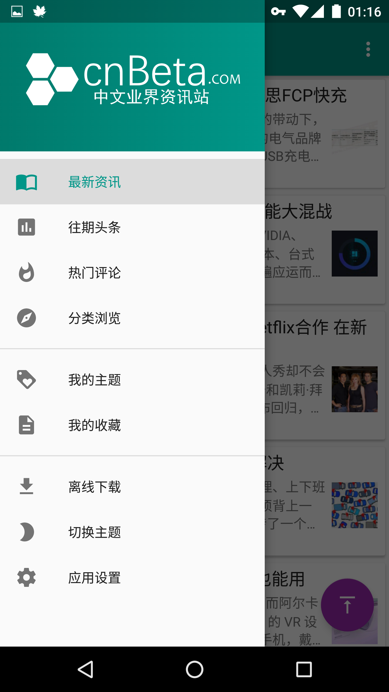
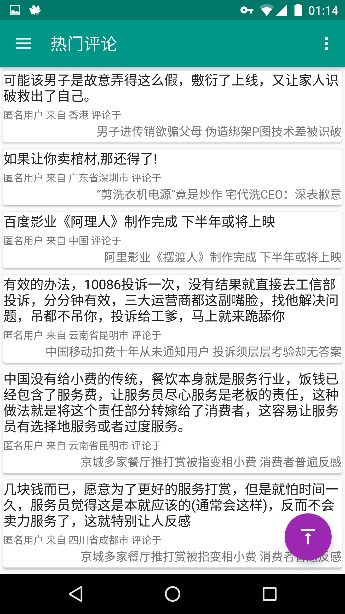
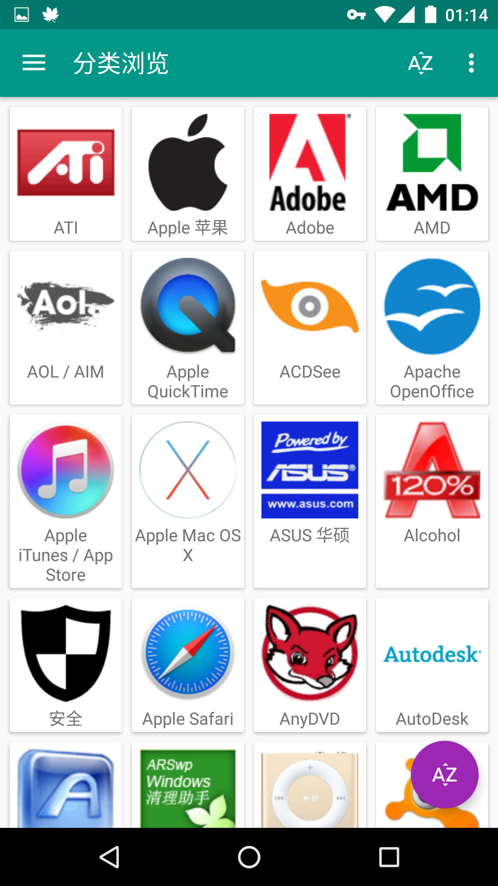
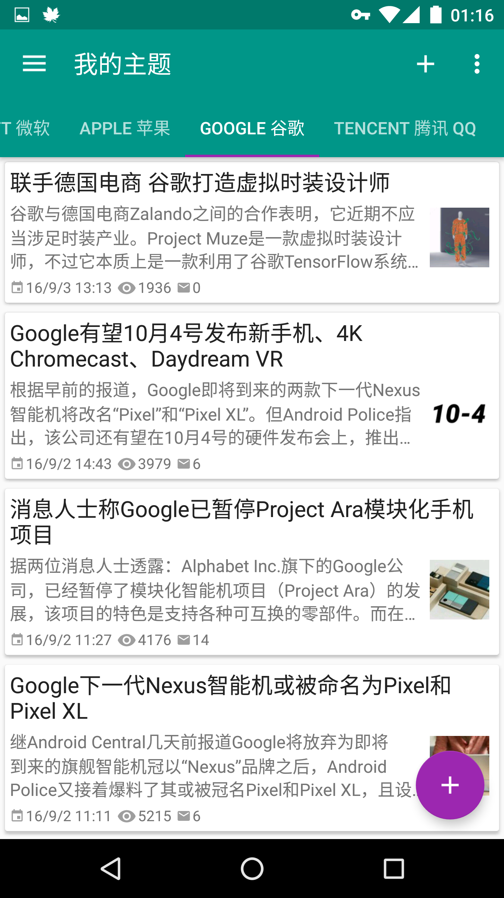
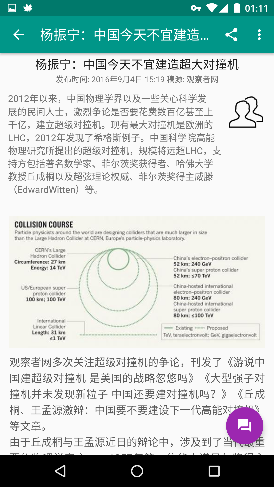
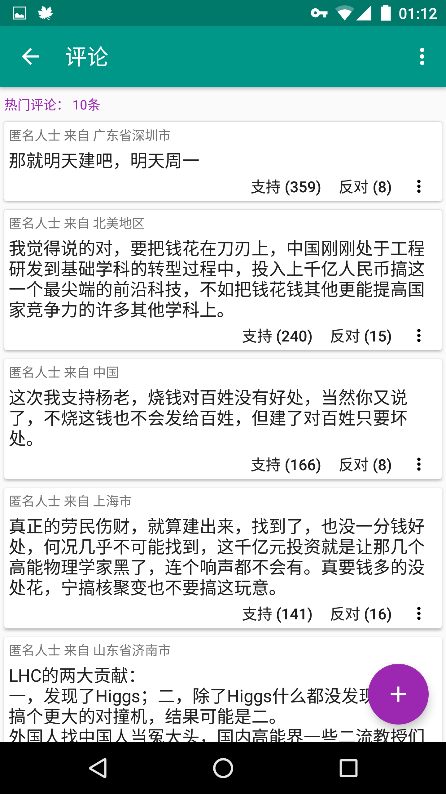
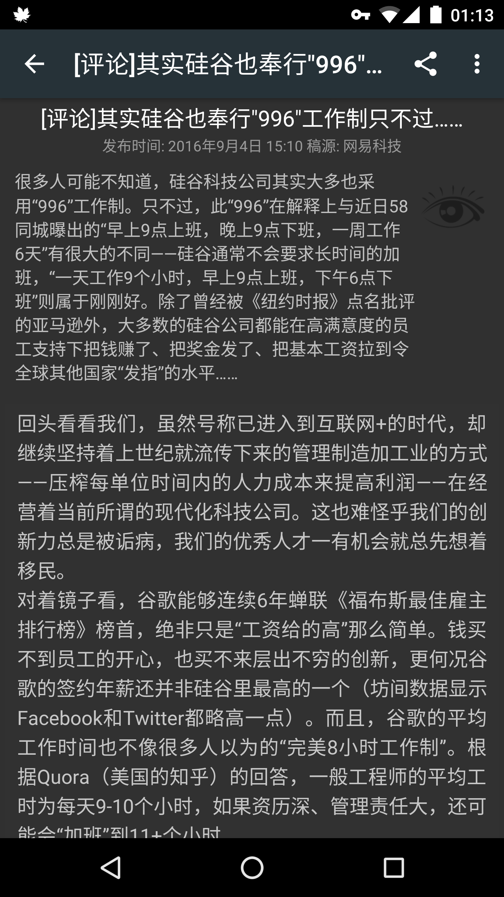
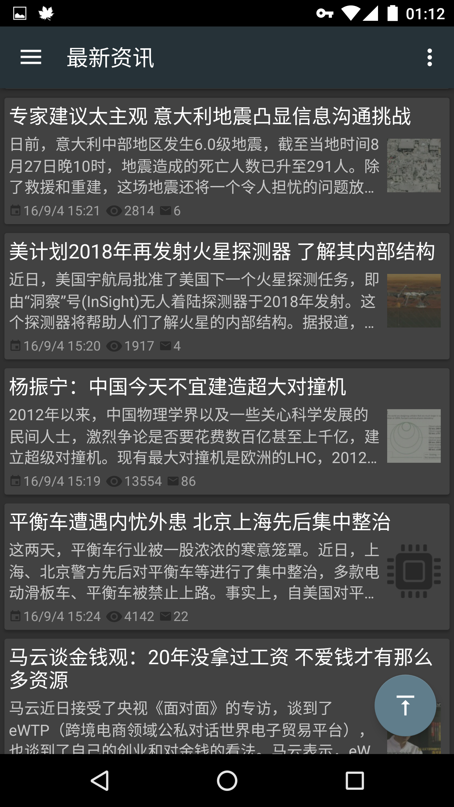
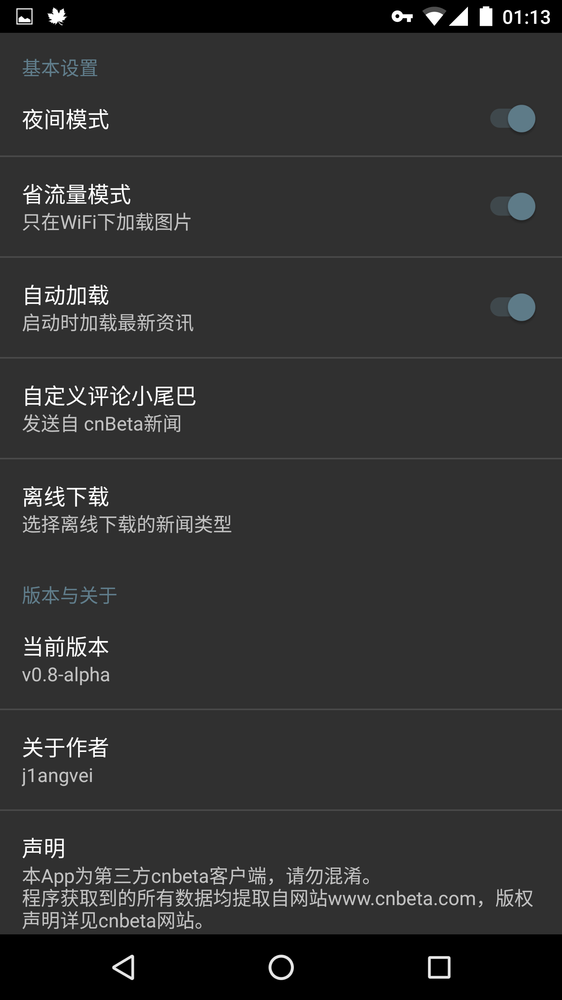

# CB News
A third-party CB News Android Application, MVP pattern, using library Dagger2, RxJava, OkHttp, Retrofit, ButterKnife Glide and Jsoup.  
## Introduction
Data source are parsed from cnBeta official website www.cnbeta.com.  
CB News Supported features are as follows:  
1. Latest news, past headlines, popular comments, classified by topics;  
2. Support bookmark topics, bookmark articles;  
3. Support view, judge, reply, add, report comments;  
4. Support data save mode, load image only in WiFi;  
5. Support offline download all types of articles;  
6. Support fully night mode;  
7. Support search article, post articles(In future).  

## Gallery

## Video
## Library
##### Dagger 2
##### RxJava & RxAndroid
##### OkHttp & Retrofit
##### ButterKnife
##### Glide
##### Jsoup
## Reference
## GitHub Project
